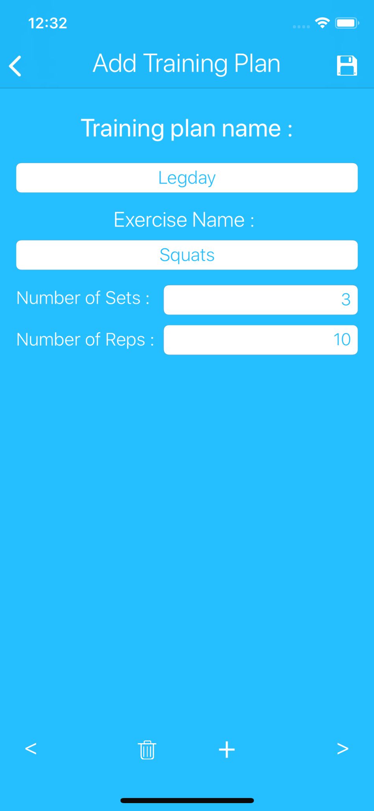
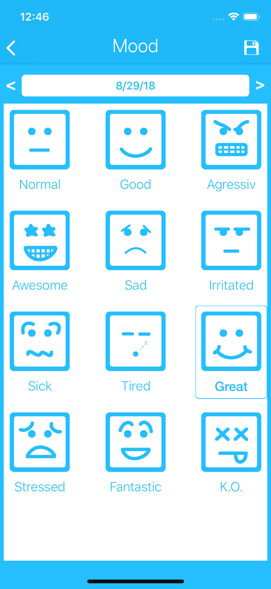
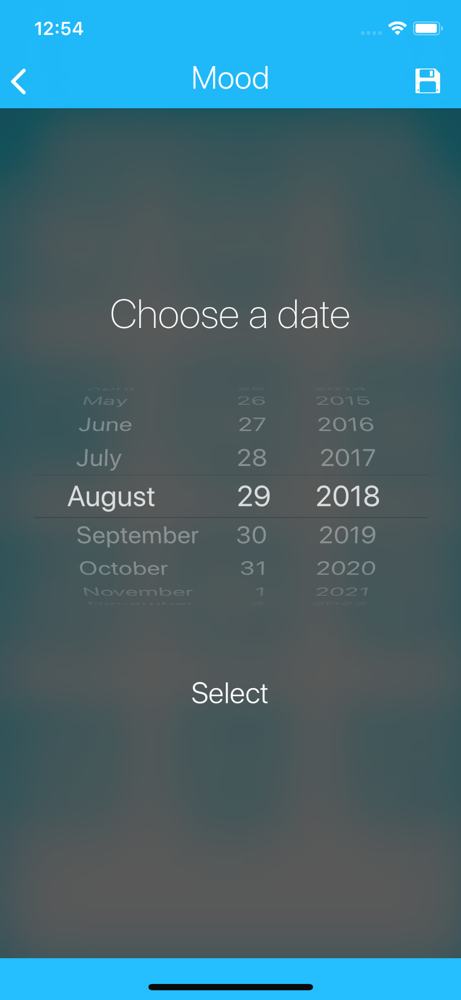
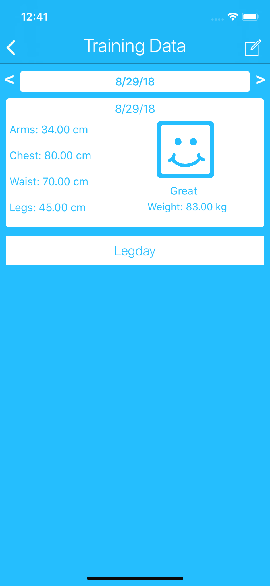
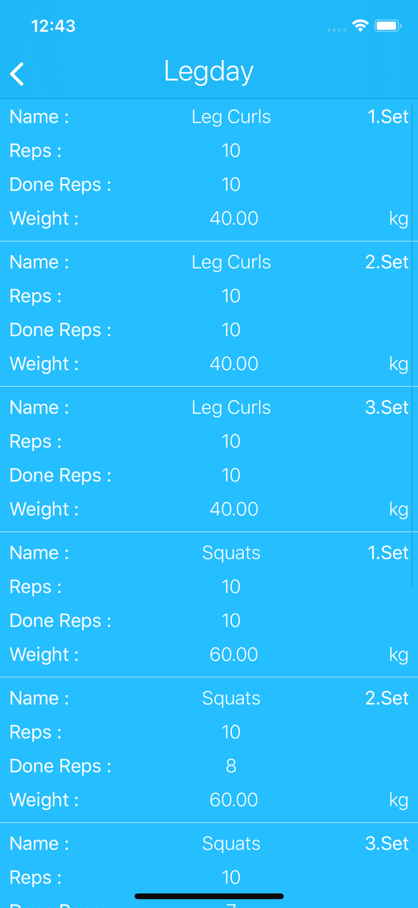
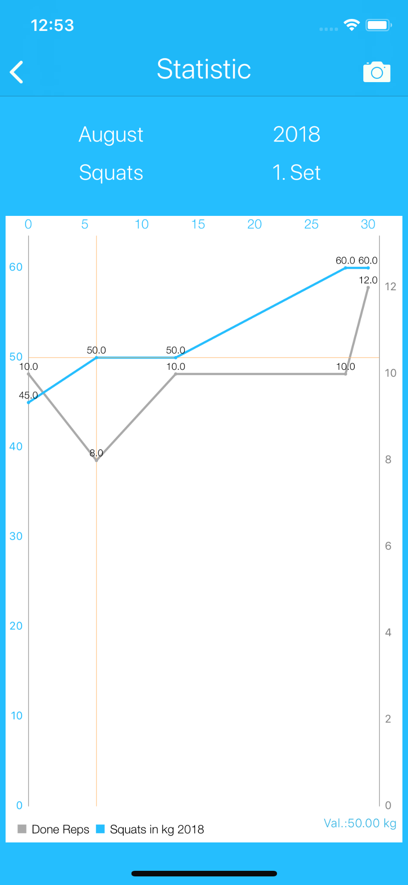

# Train2Gain

Train2Gain is an iOS application which helps to track useful data about trainings and offers the following features:
- Creating and using own training plans
- Tracking of body measurements
- Evaluating trainings via a training diary and statistics
- Built-in stopwatch during the trainings
- Different units supported
- Data protection via fingerprint and password
- Available in english and german

The application is implemented completely in Swift and was also already available in the App Store. 

  
  
